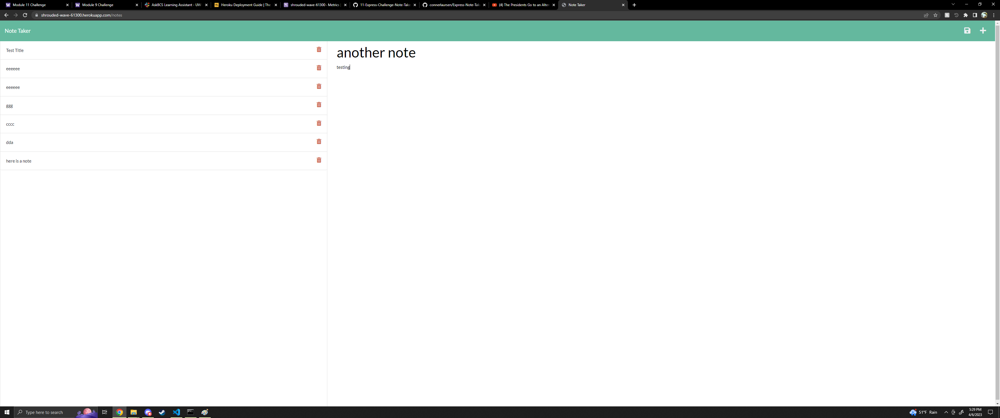

# <Section 6 Challenge>

## Description

This is the senction 6 challenge which features an aplication for creating notes.

## Image

## Usage

Use npm install and then npm start in the command line

## Website Link

https://chulleyboy.github.io/06-Server-Side-APIs-Challenge/

## License

MIT Liscense, view the license in the repository.

---
